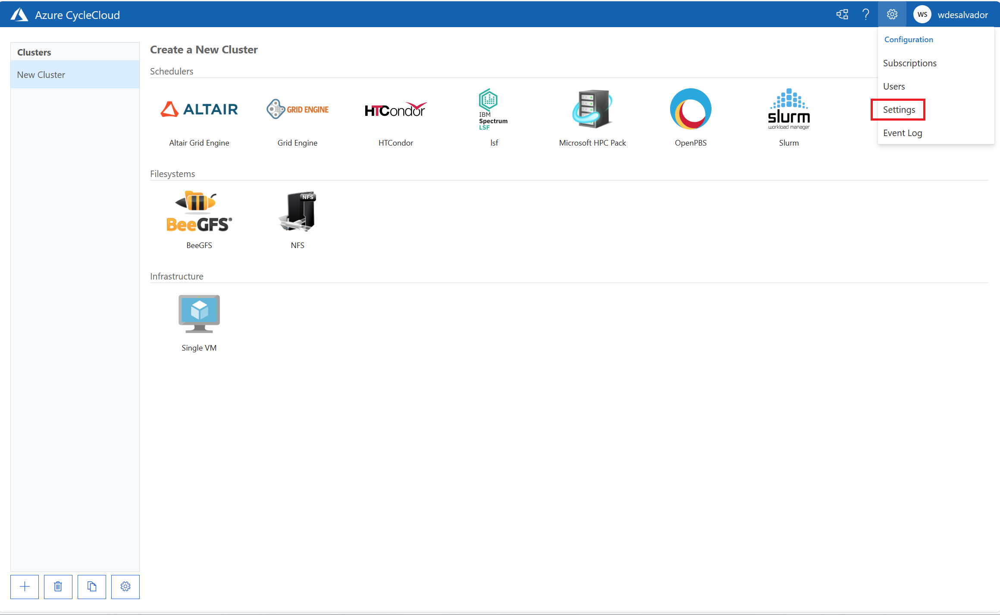
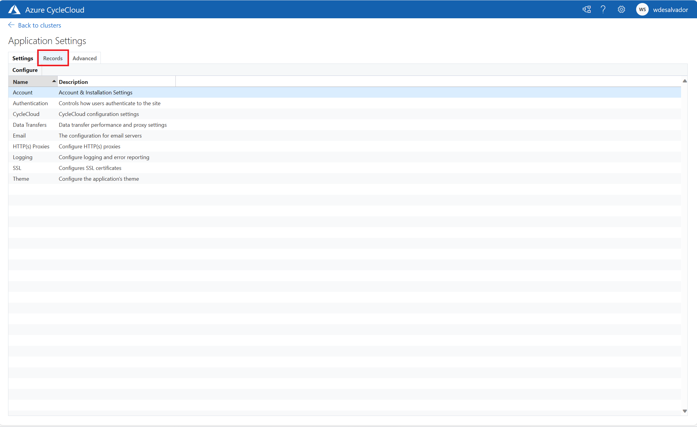
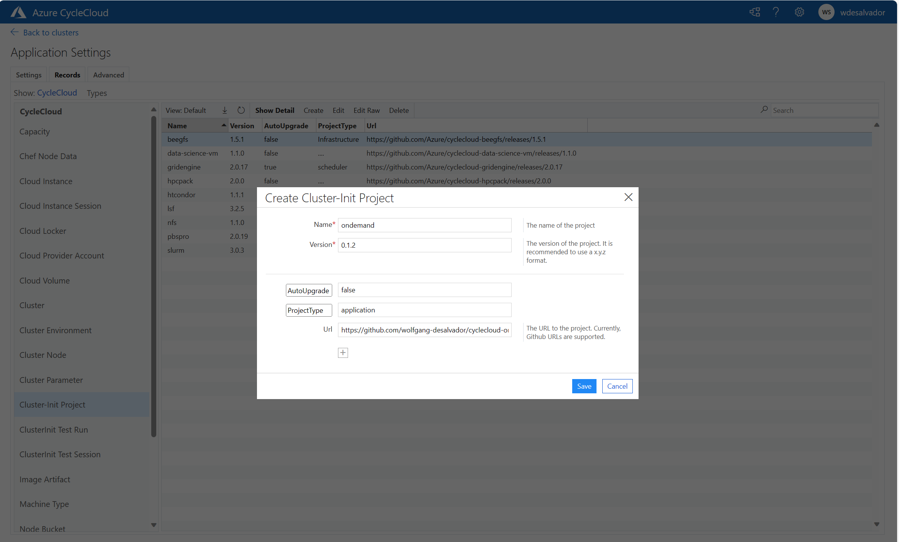
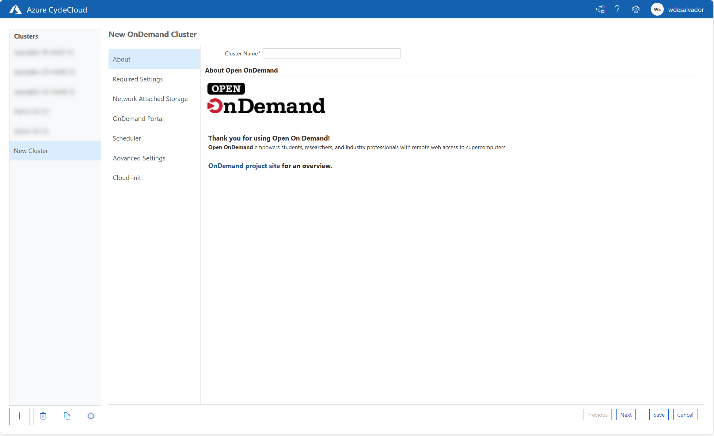

# Azure CycleCloud OnDemand

## Introduction
[Azure CycleCloud](https://learn.microsoft.com/en-us/azure/cyclecloud/overview?view=cyclecloud-8) is an Azure service that allows to orchestrate HPC cluster in Azure Cloud leveraging on standard HPC schedulers like Slurm, OpenPBS and many more.

Once a cluster is created through Azure CycleCloud, it will expose as a default a scheduler and eventually some login nodes where the users have the possibility to login in SSH or using standard scheduler APIs (e.g. SlurmAPI).

This project is aimed to provide an easy way to deploy a web portal improving user experience for job submission, SSH sessions and remote visualization.

The web portal in scope is the OpenSource project [Open OnDemand](https://openondemand.org/)

## The project
Azure CycleCloud provides the flexibility of defining in a modular way customized [projects](https://learn.microsoft.com/en-us/azure/cyclecloud/how-to/projects?view=cyclecloud-8). 

Azure CycleCloud projects are composed by three key elements:
- [*Cluster templates*](https://learn.microsoft.com/en-us/azure/cyclecloud/how-to/cluster-templates?view=cyclecloud-8), containing the relevant parameters that the users can specify in the UI during configuration.
- [*Cluster-init scripts*](), containing a set of tasks that are executed on the node preparation
- [*Blobs*](https://learn.microsoft.com/en-us/azure/cyclecloud/how-to/storage-blobs?view=cyclecloud-8), binaries which are usually installers on the compute nodes

Using this integration framework of Azure CycleCloud, this project contains a whole integration to deploy Open OnDemand portal automatically in Azure CycleCloud.

## Prerequisites
The project requires a working installazion of [Azure CycleCloud](https://learn.microsoft.com/en-us/azure/cyclecloud/overview?view=cyclecloud-8).

At the same time, Open OnDemand portal is meant to be attached to an existing Slurm or OpenPBS cluster in this context. Further support is planned to be available in future releases.

The project has been tested on the following matrix:

<table>
<tr>
<td><b>Azure CycleCloud Version</b></td>
<td><b>Scheduler</b></td>
<td><b>Scheduler Version</b></td>
<td><b>Azure CycleCloud Project Version</b></td>
</tr>
<tr>
<td>8.4.1-3154</td>
<td>Slurm</td>
<td>22.05.9 / 23.02.05</td>
<td>3.0.4</td>
</tr>
<tr>
<td>8.4.1-3154</td>
<td>OpenPBS</td>
<td>18.1.4 / 20.0.1 / 22.05.11</td>
<td>2.0.19</td>
</tr>
<tr>
<td>8.5.0-3196</td>
<td>Slurm</td>
<td>22.05.10 / 23.02.06</td>
<td>3.0.5</td>
</tr>
<tr>
<td>8.5.0-3196</td>
<td>OpenPBS</td>
<td>18.1.4 / 20.0.1 / 22.05.11</td>
<td>2.0.20</td>
</tr>
<tr>
<td>8.6.1-3248</td>
<td>Slurm</td>
<td>22.05.11 / 23.02.07</td>
<td>3.0.6</td>
</tr>
<tr>
<td>8.6.1-3248</td>
<td>OpenPBS</td>
<td>18.1.4 / 20.0.1 / 22.05.11</td>
<td>2.0.21</td>
</tr>
</table>

## Creating an Azure Key Vault

In order to store the secrets involved in OnDemand Portal configuration, an Azure Key Vault will be required to be configured. This Azure Key Vault will be accessed during configuration through a managed identity.

## Creating a Managed Identity

To create a Managed Identity for Azure OnDemand portal project, just run the following command in an Azure Cloud Shell or an Azure CLI enabled terminal (the Managed Identity can also be created by Azure Portal or by any other method):


 ```bash
az identity create --name MyIdentity --resource-group MyResourceGroup
```

where `MyIdentity` and `MyResourceGroup` are respectively the identity name and the resource group where this should be placed. Azure CycleCloud VM should have access to this resource group with the identity used to interact with Azure Subscription.

It is important to assign the `Key Vault Secrets User` to this Managed Identity on the Azure Key Vault that will be used to store the portal secrets.


## Storing secrets in Azure Key Vault

Secrets and certificates can be uploaded from the [commandline directly](https://learn.microsoft.com/en-us/cli/azure/keyvault/certificate?view=azure-cli-latest#az-keyvault-certificate-import) or using [Azure Portal](https://learn.microsoft.com/en-us/azure/key-vault/secrets/quick-create-portal).

The secrets / certificates name should then be used in the configuration of the project. 


## Importing the project in Azure CycleCloud instance

In order to import the project in the current Azure CycleCloud instance, two steps will be required:
- Importing the cluster template
- Adding the reference to the cluster-init specs in Azure CycleCloud configuration

### Importing the cluster template

The prerequisite to import the project in an existing Azure CycleCloud instance is to have an [Azure CycleCloud CLI](https://learn.microsoft.com/en-us/azure/cyclecloud/how-to/install-cyclecloud-cli?view=cyclecloud-8). This can be also the Azure CycleCloud VM itself with an SSH access.

```bash

git clone https://github.com/wolfgang-desalvador/cyclecloud-ondemand.git
cd cyclecloud-ondemand
git checkout 0.1.3
cyclecloud import_template -f templates/ondemand.txt
```

### Importing the project cluster-init specs in Azure CycleCloud definitions

There are two options to achieve this:
* Through Azure CycleCloud Web UI
* Importing the configuration through a text file placed in Azure CycleCloud installation directories

#### Through Azure CycleCloud Web UI

In order to import the cluster-init specs through the UI, it is sufficient to go to Settings > Records > CycleCloud > Cluster-Init Projects and to create a new project definition as displayed in the following pictures.

The URL for the project is `https://github.com/wolfgang-desalvador/cyclecloud-ondemand/releases/0.1.3`








#### Through the commandline

It is possible to do the same operation from commandline on the Azure CycleCloud VM.

First of asll let's elevate the permission as root on the VM

```bash
sudo su
```

Then, let's insert the following content into a file named `/opt/cycle_server/config/data/ondemand.txt`:

```bash
AdType = "Cloud.Project"
Version = "0.1.3"
ProjectType = "Application"
Url = "https://github.com/wolfgang-desalvador/cyclecloud-ondemand/releases/0.1.3"
AutoUpgrade = false
Name = "ondemand"
```

If import has been successful, after a few seconds the template name should change with the “imported” extension attached:

 ```bash
ls /opt/cycle_server/config/data/

marketplace_site_id.txt.imported  ondemand.txt.imported  settings.txt.imported  theme.txt.imported
```

## Using the project

After having completed the steps mentioned above, the option to create the OnDemand Portal will appear inside the available cluster types.


Clicking on the project, the wizared for the creation will start:



## Available configuration

The configuration wizard allows to configure the different aspects of the OnDemand portal instance, more specifically:

* Volume mounts
* Authentication
* SSL Termination
* Scheduler integration and OS configuration
* Networking

Let's describe the details of the different sections in order.

### About

This section will be used to define the name of the cluster, also the terms and conditions are defined here below.

### Required Settings

In the required settings, the following properties can be configured:

<table>
<tr>
<td><b>Property Name</b></td>
<td><b>Description</b></td>
</tr>
<tr>
<td>Region</td>
<td>The region in which the node should be deployed</td>
</tr>
<tr>
<td>Server VM Type</td>
<td>The SKU type to be used for the server</td>
</tr>
<tr>
<td>Subnet ID</td>
<td>The Subnet where the portal should be attached to. Be aware that this subnet will need to be able to communicate with the scheduler head node meant to be integrated on the dedicated scheduler ports</td>
</tr>
</table>

### Network attached storage

In the Network Attached Storage, the configuration of the cluster shared storage for home and applications (`/shared`), as well as for scheduler configuration (`/sched`).

<table>
<tr>
<td><b>Property Name</b></td>
<td><b>Description</b></td>
</tr>
<tr>
<td>Scheduler mount</td>
<td>Allows to define the IP Address, export point (on the NFS Server side) and the NFS Mount Options for /sched volume. It will mount this on the server on the /sched mount point</td>
</tr>
<td>Shared mount</td>
<td>Allows to define the IP Address, export point (on the NFS Server side) and the NFS Mount Options for /shared volume. It will mount this on the server on the /shared mount point</td>
<tr>
<td>Additional NFS Mount</td>
<td>Allows to define the IP Address, export point (on the NFS Server side), the NFS Mount Options for an additional volume.</td>
</tr>
</table>

### OnDemand Portal 

<table>
<tr>
<td><b>Property Name</b></td>
<td><b>Description</b></td>
</tr>
<tr>
<td>Portal IP</td>
<td>The IP address to be assigned to the portal NIC. This should be available in the designated Subnet</td>
</tr>
<td>Server name</td>
<td>This should be the FQDN through which the portal will be reached out. All the server endpoints will rely on this. This is important for SSL authentication. In case you are opting for a self-signed SSL certificate (insecure) you can set this equal to the Portal IP.</td>
<tr>
<td>Extra configuration</td>
<td>This will be directly appended to the OnDemand configuration YAML. <a href=https://osc.github.io/ood-documentation/latest/reference/files/ood-portal-yml.html>Refer to the official documentation</a></td>
</tr>
<tr>
<td>MSI Identity</td>
<td>This allows to select a Managed Identity to be assigned to the OnDemand portal. This is used by the portal to interact with Secrets in a dedicated Key Vault (the MSI should be assigned the Key Vault Secret Users). It is required in case authent</td>
</tr>
<tr>
<td>Vault Name</td>
<td>This is the Vault Name that will be used to store the secrets required by OnDemand portal. The server will access them thanks to the MSI identity defined above.</td>
</tr>
<tr>
<td>Authentication</td>
<td>In this sector, the authentication configuration will be defined. The options are <b>Basic (not suggested and insecure)</b>,  <b>OIDC Dex</b>, <b>OIDC AD</b>. <a href=https://osc.github.io/ood-documentation/latest/reference/files/ood-portal-yml.html>For more details refer to OnDemand documentation</a></td>
</tr>
<tr>
<td>SSL</td>
<td>This can be a self-signed certificate (it will be presented as insecure by the browser) generated automatically by the configuration scripts during installation (according to the Server Name specified), or a signed certificate in the Azure Key Vault that can be referenced as name.</a></td>
</tr>
</table>

### Scheduler 
<table>
<tr>
<td><b>Property Name</b></td>
<td><b>Description</b></td>
</tr>
<tr>
<td>Scheduler type</td>
<td>It can be OpenPBS or Slurm</td>
</tr>
<td>Scheduler host</td>
<td>The IP Address of the scheduler with whom the OnDemand portal should be integrated</td>
<tr>
<td>Scheduler version</td>
<td>Version of the scheduler according to the compatibility matrix described above.</td>
</tr>
</table>


### Advanced Settings 

<table>
<tr>
<td><b>Property Name</b></td>
<td><b>Description</b></td>
</tr>
<tr>
<td>Credentials</td>
<td>Account to be used to deploy resources as configured in Azure CycleCloud Subscriptions.</td>
</tr>
<td>Portal OS</td>
<td>The OS system to be used in the portal</td>
</table>


## Contributing

This project welcomes contributions and suggestions.  Most contributions require you to agree to a
Contributor License Agreement (CLA) declaring that you have the right to, and actually do, grant us
the rights to use your contribution. For details, visit https://cla.microsoft.com.

When you submit a pull request, a CLA-bot will automatically determine whether you need to provide
a CLA and decorate the PR appropriately (e.g., label, comment). Simply follow the instructions
provided by the bot. You will only need to do this once across all repos using our CLA.

This project has adopted the [Microsoft Open Source Code of Conduct](https://opensource.microsoft.com/codeofconduct/).
For more information see the [Code of Conduct FAQ](https://opensource.microsoft.com/codeofconduct/faq/) or
contact [opencode@microsoft.com](mailto:opencode@microsoft.com) with any additional questions or comments.